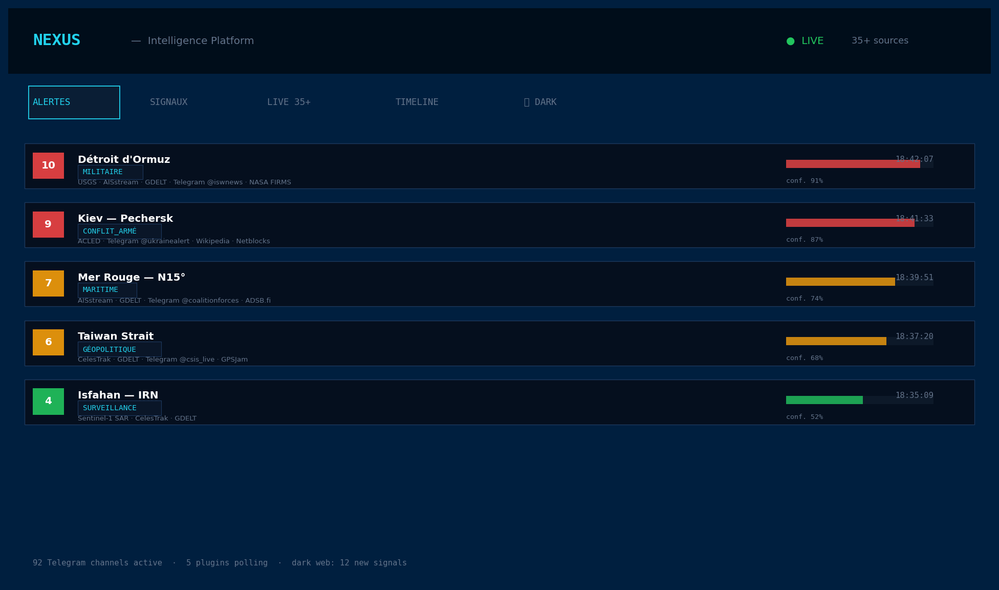
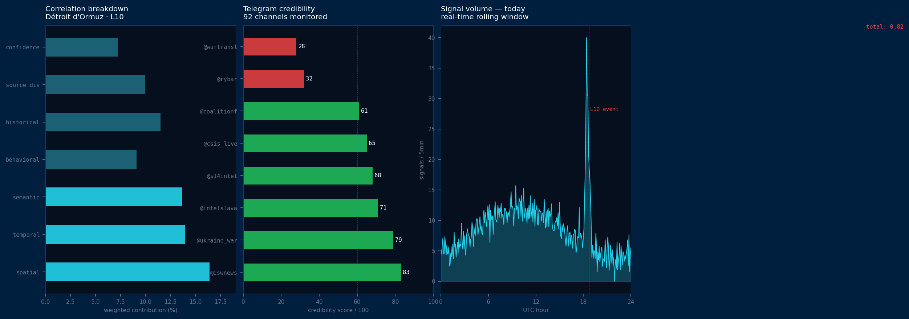
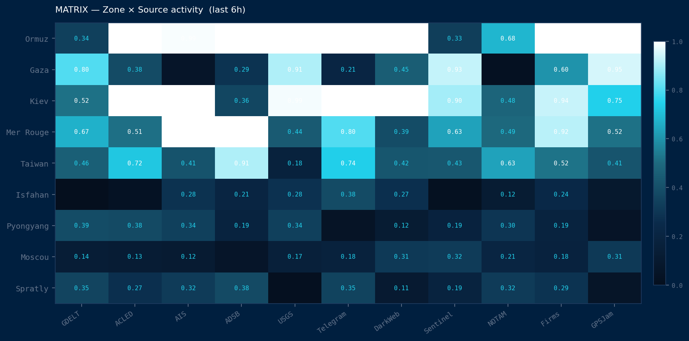

# NEXUS

I spend a lot of time on Telegram. Not for memes — for information. I follow around 90 channels: conflict zones, OSINT analysts, field journalists, AIS trackers, military bloggers on both sides of every war. Over time it became a habit, then a system, then a genuine problem.

The problem is that following all of that manually is exhausting and unreliable. You're jumping between channels, cross-referencing timestamps, trying to figure out if three posts about the same explosion are three independent sources or the same rumor bouncing around. You get it wrong half the time and you don't even know when you got it wrong.

Then I found [WorldWideView](https://github.com/silvertakana/worldwideview) on GitHub — a 3D globe built with CesiumJS and Next.js, clean architecture, proper plugin system. I looked at it for a long time and thought: what if instead of me going to the information, the information came to me — geolocated, scored, plotted in real time.

That was the idea. I started building.

---

## What it does



It pulls from 35+ open-source feeds simultaneously: satellite fire detections, seismic sensors, ADS-B aviation transponders, AIS ship tracking, GPS jamming maps, GDELT's news archive, Wikipedia edit velocity (Wikipedia gets edited *fast* when something happens — it's a better early warning signal than it sounds), internet shutdown detection from Cloudflare Radar and Netblocks, economic anomaly detection, SAR imagery from Sentinel-1 and Sentinel-2.

Every signal that enters the system gets correlated before anything surfaces on screen. The core idea: one signal is noise, two is a coincidence, three independent sources confirming the same event in the same place within a tight time window is probably real. The engine computes a score across six dimensions:

```
total = spatial×0.18 + temporal×0.16 + semantic×0.18
      + behavioral×0.14 + historical×0.14
      + source_diversity×0.12 + confidence×0.08
```

Spatial is Haversine distance from the signal cluster centroid — drops to zero beyond 500km. Temporal is how tight the time window is across signals — full weight inside 3 minutes, zero after 3 hours. Semantic uses Jaccard similarity between tokenized descriptions. Source diversity counts unique independent feeds — a signal confirmed by GDELT, AIS, Telegram, and USGS simultaneously scores near 1.0.

Nothing shows up on the globe until that total crosses a threshold. The globe is completely silent most of the time. When something appears, it means multiple independent systems reported the same thing within a few minutes of each other.

---

## The Telegram layer



92 channels, each with a credibility score. The score is based on three things: how often the channel is *first* to report something that later gets confirmed, how frequently it includes verifiable coordinates, and its historical track record on fabrication.

A channel like @iswnews gets an 83. A state propaganda outlet gets a 15 and everything it says gets down-weighted accordingly. A channel with a long history of being early and accurate gets taken seriously even with 3,000 followers. A megaphone account with 800k followers that just reposts Reuters 6 minutes late isn't worth much.

The channels are organized into clusters: Western Analytics, Neutral Aggregators, Spanish Geopolitics (there's a surprisingly strong OSINT community in Spanish), Data Visualization, and — because intellectual honesty matters — Far-Right Extremist accounts that get the maximum credibility penalty but still get monitored, because even bad actors sometimes report real events first.

A Python backend using Telethon monitors all 92 in parallel. Posts get tagged, scored, geolocated where possible, and pushed into the SSE stream as `TelegramSignal` objects.

---

## The Matrix



One of the tabs is a 9×11 heatmap — nine active zones (Ormuz, Gaza, Kiev, Red Sea, Taiwan, Isfahan, Pyongyang, Moscow, Spratlys) against eleven source categories. Each cell shows how much activity that source has generated for that zone in the last 6 hours. You can see at a glance which zones are heating up and which sources are driving it. Ormuz lighting up across AIS, GDELT, Telegram, and NOTAM simultaneously is a different situation from Ormuz lighting up only in Telegram.

---

## The dark web layer

A separate Python script handles clearnet and Tor-accessible sources: 4chan /pol/ and /k/ (messy, but genuinely fast for conflict reporting), OSINT subreddits, Bellingcat, investigative outlets through .onion mirrors, and ransomware leak sites monitored for threat intelligence. Everything goes through a Tor SOCKS5 proxy and arrives in the same SSE stream as clearnet signals, tagged `onion: true` or `false`.

---

## The science layer

The text analysis is grounded in published research rather than vibes. Every signal description gets scored by:

- **LDA topic modelling** (Mueller & Rauh, APSR 2018) — extracts the underlying topic distribution to improve semantic matching
- **Velocity penalty** (Vosoughi et al., MIT/Science 2018) — down-weights signals that spread unusually fast relative to their content type, which is a reliable misinformation signal
- **ViEWS calibration** (PRIO Oslo 2024) — maps event counts and score thresholds to conflict escalation probabilities by country
- **CUSUM anomaly detection** (sequential change-point analysis) — flags statistical anomalies in signal volume per zone in real time
- **CIB detection** (Harvard Shorenstein 2024) — scores coordinated inauthentic behavior patterns across Telegram channels
- **Sentinel SAR scorer** (ETH CSS 2024) — evaluates synthetic aperture radar anomalies against baseline satellite imagery for 7 active zones

None of these are decorative. They're wired into the scoring pipeline and affect what surfaces on screen.

---

## Running it

```bash
git clone https://github.com/Vitalcheffe/nexus-platform
cd nexus-platform
npm install
npm run dev
```

Most sources work with no key at all — GDELT, USGS earthquakes, Wikipedia, ADSB.fi, GPSJam, UN ReliefWeb. Real live data, immediately. Free registrations unlock the rest: ACLED for conflict events, NASA FIRMS for fire detections, Cloudflare Radar for internet shutdowns, AISstream for maritime.

For the Telegram collector:
```bash
pip install telethon httpx beautifulsoup4
export TELEGRAM_API_ID=...
export TELEGRAM_API_HASH=...
python3 scripts/nexus_telegram_collector.py
```

For the dark web collector, Tor needs to be running on port 9050:
```bash
tor &
python3 scripts/nexus_darkweb_collector.py
```

There's a lighter version (`nexus_replit_collector.py`) that skips Tor entirely and works on any free hosting. Deployment runs on Render.com free tier — there's a `render.yaml` already in the repo. UptimeRobot pings `/api/health` every 5 minutes to keep it awake. Total infrastructure cost: zero.

---

## Context

I'm 16. I built this because I had a real frustration with a real problem, not because it seemed like an impressive thing to build.

Most of the interesting decisions weren't about adding features — they were about what to *not* show. The globe is silent most of the time on purpose. One signal means nothing. The whole point is being disciplined enough to wait for convergence.

Some parts are still rough. There are TypeScript warnings in the original codebase I haven't fully resolved. Some demo signals are synthetic stand-ins for feeds that require credentials. The science layer is wired in but could be tuned more carefully against ground truth. It's a real project, not a portfolio piece — which means it's unfinished in the way real things are always unfinished.

If you're working in this space — geospatial intelligence, real-time data aggregation, conflict monitoring — open an issue or reach out.

---

Built on top of [WorldWideView](https://github.com/silvertakana/worldwideview) by silvertakana. License: MPL-2.0.

**References:** Mueller & Rauh (2018) APSR · Vosoughi et al. (2018) Science · PRIO ViEWS (2024) · ETH CSS (2024) · Harvard Shorenstein (2024) · Haversine formula (Sinnott, 1984)
